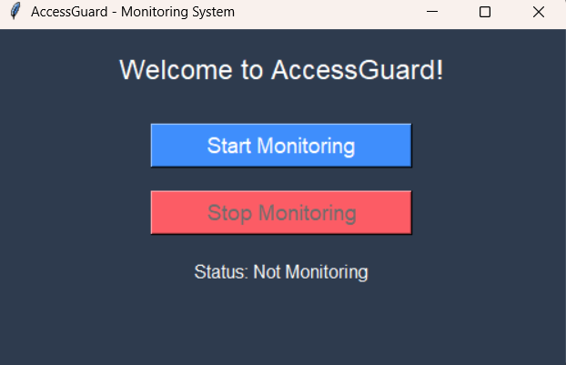
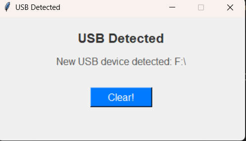
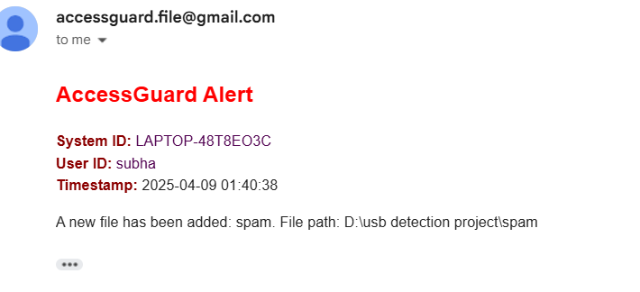

# AccessGuard 🔒 – USB Detection & File Monitoring System

A Python-based security application to detect unauthorized USB access, monitor file activity, and send alert emails to HR or admins in real-time.

---

## 🚀 Features


- 🔌 USB Device Detection with whitelist support
- 📁 File Monitoring (Add, Modify, Delete)
- ✉ Email Alerts on unauthorized access
- ✅ Whitelisted USBs via `usb_whitelist.txt`
- 🌐 Web Frontend to display project and controls
- 🖥️ Simple GUI interface (Tkinter)
- 📄 Log file: `accessguard_log.txt`

---

## 🛠️ Technologies Used

- Python
- HTML, CSS (Frontend)
- `psutil`, `os`, `tkinter`, `smtplib`
- Gmail SMTP for alerts
- Git for version control & GitHub

---


## 🧪 How to Use

1. Clone this repo
2. Create virtual environment: `python -m venv accessguard-env`
3. Install requirements: `pip install -r requirements.txt`
4. Run `usb_detection.py` to monitor USBs
5. Use frontend or GUI to start/stop monitoring

---

## 🖼️ Screenshots

### 🏠 GUI Home Screen


### ⚠️ USB Alert Detected


### 📂 File Monitoring in Action


### ✅ Email Sent Notification


### Email


---

## 🔽 Download Project

[📦 Download ZIP](https://github.com/codewithsubham66/accessguard-usb-monitor/raw/main/accessguard_code.zip)

---

## 📦 Installation

```bash
pip install -r requirements.txt
