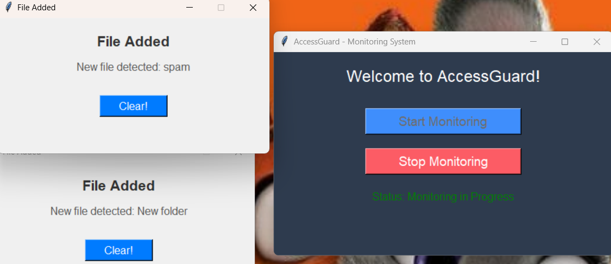

# AccessGuard 🔒 – USB Detection & File Monitoring System

A Python-based security application to detect unauthorized USB access, monitor file activity, and send alert emails to HR or admins in real-time.

---

## 🚀 Features

- 🔌 Detects when USB devices are inserted or removed
- 📝 Monitors critical file changes in real-time
- 📧 Sends automated email alerts with system info
- 🖥️ Simple GUI interface for users
- 📄 Log file generation for records

---

## 🛠️ Technologies Used

- Python
- `psutil`, `os`, `tkinter`, `smtplib`
- Gmail SMTP for alerts
- Git for version control

---

## 🖼️ Screenshots

### 🏠 GUI Home Screen


### ⚠️ USB Alert Detected


### 📂 File Monitoring in Action


### ✅ Email Sent Notification


### Email


---

## 📦 Installation

```bash
pip install -r requirements.txt
